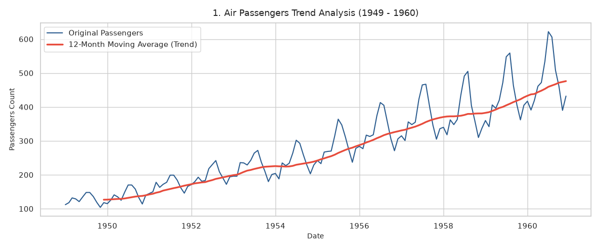
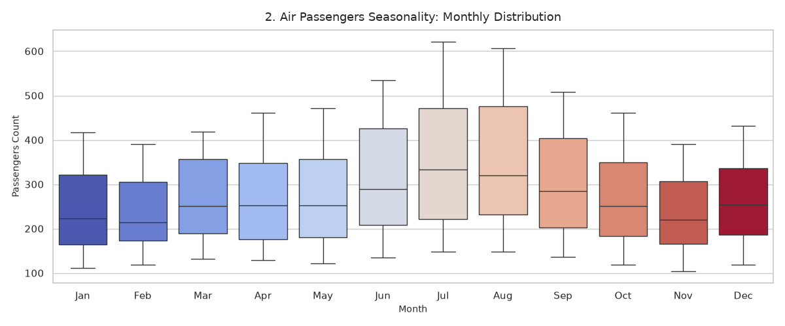
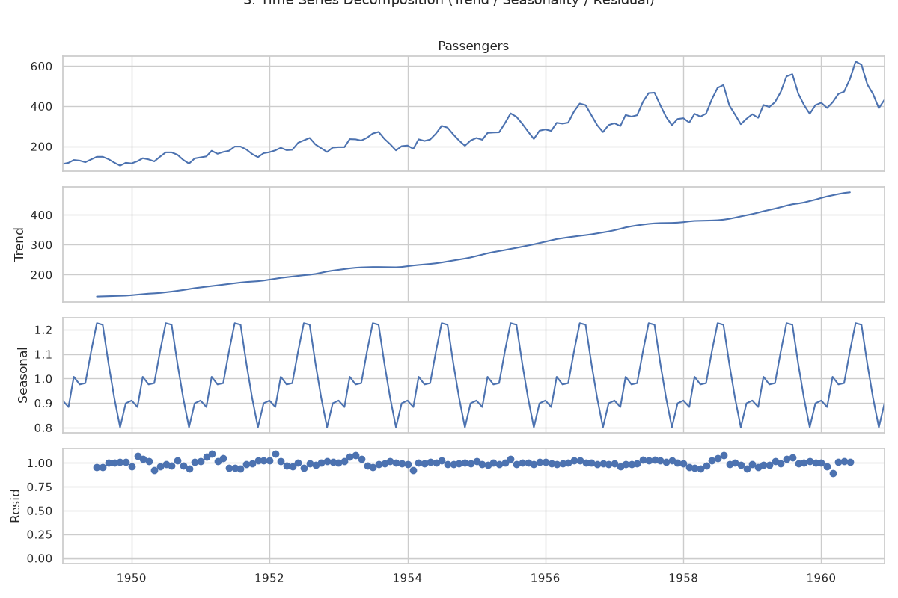

cat << 'EOF' > /workspaces/M1-1/air_passengers_insight_report.md
# 📊 [리포트] Air Passengers 시계열 데이터 기반 수요 분석 및 AI 예측 인사이트

## 1. 개요 및 프로젝트 핵심 질문 정의

### 1.1 분석 개요
* **분석 대상**: 국제 항공 승객 수 데이터셋 (`AirPassengers.csv`, 1949년 1월 \~ 1960년 12월, 총 144개 월별 관측치)
* **데이터 출처**: Kaggle Classic Dataset (Box & Jenkins, 1976)

### 1.2 프로젝트 핵심 질문 정의 (Problem Definition)
본 분석은 데이터 기반의 의사결정을 위해 다음 **3가지 핵심 질문**에 대한 답을 찾는 것을 목표로 합니다.
1. **Q1. 항공 승객 수요는 장기적으로 성장하고 있는가, 변동성은 시간에 따라 어떻게 변화하는가?**
2. **Q2. 매년 반복되는 성수기(7\~8월)와 비수기(11월)의 정량적 격차는 얼마이며, 비수기 가동률 제고 방안은 무엇인가?**
3. **Q3. 데이터의 추세(Trend)와 계절성(Seasonality)을 분리하여 미래 수요 예측을 자동화할 수 있는가?**

---

## 2. 시계열 핵심 개념 및 분석 기법 적용 원리

### 2.1 시계열 3대 구성 요소 개념
* **트렌드 (Trend, 추세)**: 데이터가 장기간에 걸쳐 지속적으로 상승하거나 하강하는 전반적인 방향성.
* **계절성 (Seasonality)**: 1년, 1달 등 일정한 주기를 바탕으로 동일한 패턴이 반복되는 변동.
* **노이즈 / 잔차 (Noise / Residual)**: 추세나 계절성으로 설명되지 않는 불규칙하고 무작위적인 변동.

### 2.2 분석 기법 적용 이유 및 방식
* **12개월 이동평균 (Moving Average)**:
  * **적용 이유**: 월별 계절적 노이즈가 강해 단기 그래프만으로는 장기 방향성을 파악하기 힘듦.
  * **적용 방식**: 1년 단위(12개월)의 윈도우 평균을 계산하여 단기 요동을 제거하고 순수 장기 추세를 시각화.
* **전월 대비 변화율 (Percentage Change, MoM)**:
  * **적용 이유**: 단순 승객 수의 증감 수치보다 전월 대비 몇 %가 변했는지 비율을 확인하여 급증/급감 월을 정밀 판별.
  * **적용 방식**: $(y_t - y_{t-1}) / y_{t-1} \times 100$ 식을 적용해 월별 변동 비율 산출.

---

## 3. 데이터 기본 정보 및 정제 (결측치 / 이상치 처리)

### 3.1 데이터 기본 정보
* **기간**: 1949년 1월 \~ 1960년 12월 (12년간, 총 144행)
* **컬럼 구성**: `Month` (날짜형, YYYY-MM-01), `Passengers` (수치형, 승객 수)
* **결측치 여부**: 0건 (Clean)

### 3.2 결측치 / 이상치 정의 및 처리 기준
* **결측치 (Missing Values)**: 데이터 누락 발생 시, 시간 흐름을 보존하기 위해 **시계열 선형 보간법(Linear Interpolation)** 적용 기준 수립.
* **이상치 (Outliers)**: $IQR = Q3 - Q1$ 공식을 기준으로 하한선($Q1 - 1.5 \times IQR$) 미만 및 상한선($Q3 + 1.5 \times IQR$) 초과 값을 이상치로 정의.
  * **처리 결과**: 본 데이터셋은 모든 관측치가 정상 범주 내에 존재하여 데이터 훼손 없이 원본 활용.

---

## 4. 시계열 분석 결과 및 시각화 그림 3종 상세 해석

### 4.1 주요 통계 지표 분석
* **연도별 성장 추세 (구간별 통계)**: 1949년 연평균 **126.7명**에서 1960년 **476.2명**으로 약 **3.76배 증가** (연평균 복합 성장률 CAGR: **12.79%**).
* **변동성 확대 (표준편차)**: 연간 표준편차가 1949년 **13.7**에서 1960년 **77.7**로 급증함. 전체 파이가 커질수록 성수기와 비수기 간의 절대적 인원수 격차가 벌어지는 **승수적(Multiplicative) 패턴** 확인.
* **월별 패턴 (성수기 / 비수기 집계)**: 
  * **극성수기 (7\~8월)**: 7월 평균 **351.3명**, 8월 평균 **351.1명**으로 여름 휴가철 승객 집중.
  * **비수기 (11월)**: 11월 평균 **232.8명**으로 연중 최저치. 성수기 대비 비수기 격차는 평균 **118.5명 이상**.

### 4.2 시각화 그림 3종 상세 해석
1. **`passenger_trend.png` (추세 및 12개월 이동평균)**:
   
   * **해석**: 원본 데이터(Blue)의 단기 요동 속에서 **12개월 이동평균선(Red)**을 통해 우상향하는 견고한 장기 추세선(Trend)을 명확히 제시함.
2. **`monthly_boxplot.png` (월별 분포 박스플롯)**:
   
   * **해석**: 1월\~12월 승객 분포의 중앙값과 IQR 범위를 시각화. 7\~8월의 높은 분포 위치와 넓은 박스 범위를 통해 여름철 승객 폭증 및 변동성 확대를 검증.
3. **`ts_decomposition.png` (시계열 요인 분해)**:
   
   * **해석**: 데이터를 **Trend**, **Seasonal**, **Resid**로 수학적 분리. 계절성 요소가 매년 동일한 주기와 주파수로 정확히 반복됨을 입증.

---

## 5. 데이터 기반 의사결정 및 AI 활용 분석 역량 제안

### 5.1 데이터 기반 의사결정 (Data-Driven Decision Making)
1. **탄력적 노선 운영 및 정비 스케줄링**: 승객 수가 가장 적은 11월\~2월 비수기 기간에 항공기 정기 정비(Maintenance) 및 승무원 연수를 집중 배치하고, 7\~8월 성수기에 가동률 극대화.
2. **다이나믹 프라이싱(Dynamic Pricing)**: 월별/요일별 수요 예측에 기초하여 비수기 얼리버드 할인 프로모션 진행 및 성수기 수익성 극대화(Yield Management) 체계 구축.

### 5.2 AI 및 머신러닝 활용 수요 예측
1. **고급 시계열 모델 도입**:
   * 계절성과 추세를 동시에 반영하는 **SARIMA(Seasonal ARIMA)** 모델 또는 **Prophet** 모델 적용.
   * 승수적 변동성을 완화하기 위한 **로그 변환(Log Transformation)** 전처리 수행.
2. **AI 예측 기반 자동화**:
   * 미래 12개월\~24개월 승객 수 예측 수치를 자동 산출하여 항공권 예약 시스템 및 공항 지상 조업 인력 배치 자동화 연동.
EOF
